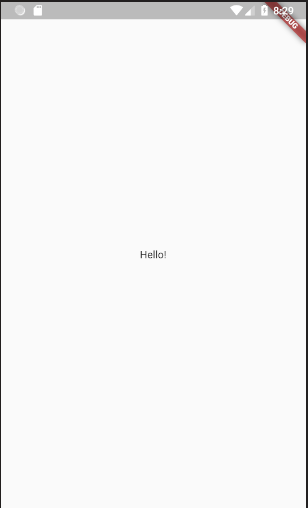

## 1-blank-app

This is a completely blank application.

### Objectives

Remove everything that is not needed and generate a blank application.

- Create a new folder `/src` inside of `/lib` where we will write all our code but the `main.dart` file where the initialization takes place.
- Create a new folder `/screens` inside of `/lib/src` where we will create our screens.
- Create a file `my_home_screen.dart` and move the initial page (screen) to that folder.
- The `main.dart` file should be something like this (plus imports):

```dart
void main() => runApp(MyApp());

class MyApp extends StatelessWidget {
  @override
  Widget build(BuildContext context) {
    return MaterialApp(
      title: 'Flutter Demo',
      theme: ThemeData(
        primarySwatch: Colors.blue,
      ),
      home: MyHomeScreen(),
    );
  }
}
```

The resulting app should look like this:


### Widgets required

You will probably have to use the following widgets and resources:

- MaterialApp for the main application

- Scaffold for the new screen

- Text to display a the **Hello!** message

### Pay attention to

There is a bunch of vscode keyboard shortcuts and other tips to generate/refactor widgets. Get used to them as they are very helpful!

Dart provides a detailed guide of conventions in [dart style guide](https://www.dartlang.org/guides/language/effective-dart/style).
