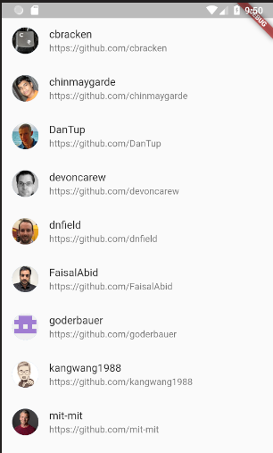

## 3-format-list

Time to add some format to the list.

### Objectives

We are going to replace the `Text` widget with the name with something better.

1. Create a file `member_tile.dart` inside `src/widgets` and copy the following.

```dart
class MemberTile extends StatelessWidget {
  final Member member;

  MemberTile(this.member);

  @override
  Widget build(BuildContext context) {
    return ListTile(
      leading: CircleAvatar(
        backgroundImage: NetworkImage(member.avatarUrl),
      ),
      title: Text(member.login),
      subtitle: Text(member.htmlUrl),
    );
  }
}
```

2. Now let's use it in our `MembersListScreen` instead of Text.

```dart
return Scaffold(
  body: ListView.builder(
    itemCount: members.length,
    itemBuilder: (context, index) {
      return MemberTile(members[index]);
    },
  ),
);
```

The resulting app should look like this:



### Widgets required

You will probably have to use the following widgets and resources:

- ListTile for the list of members

- CircleAvatar and NetworkImage to display the image for each member

### Pay attention to

ListTile has a lot of different options to give some style to the items within the list, but remember you can use any widget instead of ListView.
