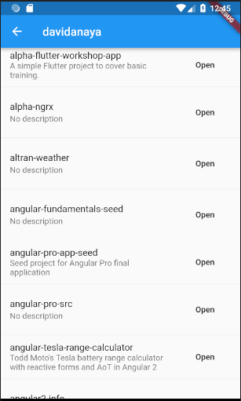

## 7-open-url-repo

Add a new feature, when clicking on a button in one of the repos, open it in a web broser.

### Objectives

Add a button at the end of each repo tile. On tap, open a web browser and load the url for the repo.

1. You can use the dart library [url_launcher](https://pub.dartlang.org/packages/url_launcher).

2. Add a button to each repo, you can use the named property `trailing`. Use a `MaterialButton` with `onPressed` listener to open the url.

The repos screen should look like this:

### Widgets required

You just need a `MaterialButton` to add the button to the tile.

### Pay attention to

Follow the readme in the pub library to understand how to use the plugin. Remember to update the pubspec.yaml. Sometimes you need to hot restart the app when you add new libraries.
