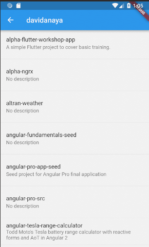

## 6-member-repos

Display the list of github repos for a particular member.

### Objectives

There are 2 branches for this exercise. You can start with `6-member-repos-start`, where I included a few tips in the code, or do it from scratch. There is also a `6-member-repos-final` with the final code.

These are the steps and requirements that you have to follow:

1. Create a new model for the repos, call it `Repo`.

2. Implement a new method in the provider to retrieve the repositories for a particular user, call the method `getReposFromMember` and pass the name of the member as parameter.

3. Create a new widget to display a repo in the new screen. Call it `RepoTile`.

4. Update `MemberReposScreen` to retrieve the list of repos for a particular member and show them in the screen. Also, display the name of the user in the header bar when navigating in.

The new screen should look like this:

### Widgets required

You don't need new widgets for this exercise.

### Pay attention to

There are a few different ways that you can use to get the desired result. You could retrieve the repos for a member in `MembersListScreen` and pass them to the new screen, but we want to see how to deal with this use case where we need to inject a dependency to the new screen that is not available. That's why to move the navigation logic to `main.dart`.
