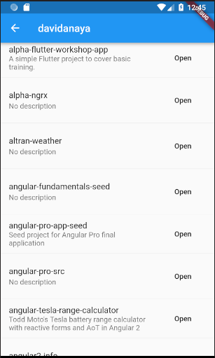

## 0-counter-app

This is the default _Hello World_ project that we get when we create a new Flutter project.

It consists on a single page with a floating button and a counter label. By clicking the button the counter is incremented.

### Objectives

None.

### Pay attention to

- `StatelessWidget`

- `StatefulWidget` and concept of state

- `MaterialApp` and `Scaffold`

- Flutter composition model (widget tree)

- Everything is a widget! (well, not everything)

- pubspec.yaml

- android and ios folders

- test folder and debug

## 1-blank-app

This is a completely blank application.

### Objectives

Remove everything that is not needed and generate a blank application.

- Create a new folder `/src` inside of `/lib` where we will write all our code but the `main.dart` file where the initialization takes place.
- Create a new folder `/screens` inside of `/lib/src` where we will create our screens.
- Create a file `my_home_screen.dart` and move the initial page (screen) to that folder.
- The `main.dart` file should be something like this (plus imports):

```dart
void main() => runApp(MyApp());

class MyApp extends StatelessWidget {
  @override
  Widget build(BuildContext context) {
    return MaterialApp(
      title: 'Flutter Demo',
      theme: ThemeData(
        primarySwatch: Colors.blue,
      ),
      home: MyHomeScreen(),
    );
  }
}
```

The resulting app should look like this:


### Widgets required

You will probably have to use the following widgets and resources:

- `MaterialApp` for the main application

- `Scaffold` for the new screen

- `Text` to display a the **Hello!** message

### Pay attention to

There is a bunch of vscode keyboard shortcuts and other tips to generate/refactor widgets. Get used to them as they are very helpful!

Dart provides a detailed guide of conventions in [dart style guide](https://www.dartlang.org/guides/language/effective-dart/style).

## 2-github-org-members

In this exercise we will use some fake json data to display a list of members from a github organization.

You can get your own data from [https://api.github.com/orgs/flutter/members].

### Objectives

This is the list of steps required:

1. Create a file `members.dart` inside `src/data` folder where we will store our data for now and export it as a dart variable, like this:

```dart
final String members = '''
[
  {
    "login": "cbracken",
    "id": 351029,
    "node_id": "MDQ6V
    ...
  }
]
''';
```

2. We need to parse the json String into a proper dart object. Create a `member.dart` inside `src/models` with a named constructor `Member.fromJson` that will be used to generate instances of `Member` from the json. We will only save a few properties from the original data.

```dart
class Member {
  final String login;
  final int id;
  final String avatarUrl;
  final String url;
  final String htmlUrl;
  final String reposUrl;

  Member.fromJson(Map<String, dynamic> json)
      : login = json['login'],
        id = json['id'],
        avatarUrl = json['avatar_url'],
        url = json['url'],
        htmlUrl = json['html_url'],
        reposUrl = json['repos_url'];
}
```

3. Time to fetch the data. For now we will fake also the http call and return the data directly.

   Create a folder `src/providers` with a file inside named `github_api_provider.dart` with a single method to retrieve and parse our members.

```dart
class GithubApiProvider {
  List<Member> getMembers() {
    final List<dynamic> parsedList = json.decode(members);
    final membersList =
        parsedList.map((parsed) => Member.fromJson(parsed)).toList();
    return membersList;
  }
}
```

4. We need now a widget to display the list of members in the app. Let's create a new screen `members_list_screen.dart` with a ListView to display the data.

```dart
class MembersListScreen extends StatelessWidget {
  final GithubApiProvider githubProvider;

  MembersListScreen(this.githubProvider);

  @override
  Widget build(BuildContext context) {
    final List<Member> members = githubProvider.getMembers();

    return Scaffold(
      body: ListView.builder(
        itemCount: members.length,
        itemBuilder: (context, index) {
          return Text(members[index].login);
        },
      ),
    );
  }
}
```

5. We just need to inject our `GithubApiProvider` into the screen constructor. The best place to initialize the provider is at the top of the widget tree, in the app initialization (`main.dart`).

```dart
void main() {
  final githubProvider = GithubApiProvider();

  runApp(MyApp(githubProvider));
}

class MyApp extends StatelessWidget {
  final githubProvider;

  MyApp(this.githubProvider);

  @override
  Widget build(BuildContext context) {
    return MaterialApp(
      title: 'Flutter Demo',
      theme: ThemeData(
        primarySwatch: Colors.blue,
      ),
      home: MembersListScreen(githubProvider),
    );
  }
}
```

6. We can delete `my_home_screen.dart` as we don't use it anymore.

The resulting app should look like this:


### Widgets required

You will probably have to use the following widgets and resources:

- `ListView` for the list of members

- `Text` to display the name of each member

### Pay attention to

**JSON handling** is not as easy as with javascript and we need to do some parsing. There are different strategies to deal with this. You can check Flutter documentation for more information on the topic.
[https://flutter.io/docs/development/data-and-backend/json]

A couple of resources that can be interesting when you start using dart:

[https://dartpad.dartlang.org/]

[http://json2dart.com/]

## 3-format-list

Time to add some format to the list.

### Objectives

We are going to replace the `Text` widget with the name with something better.

1. Create a file `member_tile.dart` inside `src/widgets` and copy the following.

```dart
class MemberTile extends StatelessWidget {
  final Member member;

  MemberTile(this.member);

  @override
  Widget build(BuildContext context) {
    return ListTile(
      leading: CircleAvatar(
        backgroundImage: NetworkImage(member.avatarUrl),
      ),
      title: Text(member.login),
      subtitle: Text(member.htmlUrl),
    );
  }
}
```

2. Now let's use it in our `MembersListScreen` instead of Text.

```dart
return Scaffold(
  body: ListView.builder(
    itemCount: members.length,
    itemBuilder: (context, index) {
      return MemberTile(members[index]);
    },
  ),
);
```

The resulting app should look like this:


### Widgets required

You will probably have to use the following widgets and resources:

- `ListTile` for the list of members

- `CircleAvatar` and `NetworkImage` to display the image for each member

### Pay attention to

ListTile has a lot of different options to give some style to the items within the list, but remember you can use any widget instead of ListView.

## 4-futures

Real http calls to github api.

### Objectives

It's time to replace the fake data with real one fetched from api.github with http.

1. Add the [http library](https://pub.dartlang.org/packages/http) to our [pubspec.yaml](../pubspec.yaml)

   Just edit the file and make sure the `dependencies` section looks like this:

```yaml
dependencies:
  flutter:
    sdk: flutter

  # The following adds the Cupertino Icons font to your application.
  # Use with the CupertinoIcons class for iOS style icons.
  cupertino_icons: ^0.1.2

  http: ^0.12.0+1
```

VSCode should automatically update the libraries, or you can run `flutter packages get`.

2. We need to modify our provider to get the real data. The important part here is that we are now returning a Future (Promise) instead of just the list of members.

```dart
Future<List<Member>> getMembers() async {
  final response =
      await http.get('https://api.github.com/orgs/Alpha-health/members');
  final List<dynamic> parsedList = json.decode(response.body);
  final membersList =
      parsedList.map((parsed) => Member.fromJson(parsed)).toList();
  return membersList;
}
```

3. Now to use it, we need a special widget, `FutureBuilder`.

```dart
Widget build(BuildContext context) {
  return Scaffold(
    body: FutureBuilder(
        future: githubProvider.getMembers(),
        builder: (context, AsyncSnapshot<List<Member>> snapshot) {
          return snapshot.hasData
              ? _buildList(snapshot.data)
              : Center(child: CircularProgressIndicator());
        }),
  );
}

Widget _buildList(List<Member> members) {
  return ListView.builder(
    itemCount: members.length,
    itemBuilder: (context, index) {
      return MemberTile(members[index]);
    },
  );
}
```

The app should look exactly the same, but now we will get a small delay while we fetch the items and a spinner should be displayed while we do that.

### Widgets required

You will probably have to use the following widgets and resources:

- `FutureBuilder` to build a widget based on a Future.

- `CircularProgressIndicator` to display a basic spinner.

### Pay attention to

Adding Futures means we start dealing with asynchrony and everything might get a bit more complicated. Flutter (dart) has excellent support for Futures and Streams (with the equivalent `StreamBuilder`).

## 5-navigation

Navigate to a new page (named route).

### Objectives

We are going to introduce navigation in the app. The new page will be accessible by clicking in a member in the list and will eventually display the list of github repos for that particular member.

1. Let's create the new page. It will be an empty page with a header and the name of the screen displayed. Call it `MemberReposScreen` and place it in the right folder in the project structure.

   _(tip: use appBar named parameter in Scaffold to add a header bar with a back button)_

2. We need to navigate to that page. There are a few ways to do it, but in this case we will use normal `Navigator.push`. Use the `tap` listener in `ListTile` in our custom widget `MemberTile`.

```dart
Widget build(BuildContext context) {
  return ListTile(
    leading: CircleAvatar(
      backgroundImage: NetworkImage(member.avatarUrl),
    ),
    title: Text(member.login),
    subtitle: Text(member.htmlUrl),
    onTap: () => Navigator.push(
          context,
          MaterialPageRoute(builder: (context) => MemberReposScreen()),
        ),
  );
}
```

That's it, you should be able to navigate to the new page and back

### Widgets required

You will probably have to use the following widgets and resources:

- `Scaffold` with `appBar` for the header navigation bar.

- `Navigator` to navigate between pages.

### Pay attention to

There are a few ways to navigate in Flutter, always using `Navigator` to trigger the navigation.

In this case what we did is fine, but what if we need to pass parameters or inject any dependency?

## 6-member-repos

Display the list of github repos for a particular member.

### Objectives

There are 2 branches for this exercise. You can start with `6-member-repos-start`, where I included a few tips in the code, or do it from scratch. There is also a `6-member-repos-final` with the final code.

These are the steps and requirements that you have to follow:

1. Create a new model for the repos, call it `Repo`.

2. Implement a new method in the provider to retrieve the repositories for a particular user, call the method `getReposFromMember` and pass the name of the member as parameter.

3. Create a new widget to display a repo in the new screen. Call it `RepoTile`.

4. Update `MemberReposScreen` to retrieve the list of repos for a particular member and show them in the screen. Also, display the name of the user in the header bar when navigating in.

The new screen should look like this:


### Widgets required

You don't need new widgets for this exercise.

### Pay attention to

There are a few different ways that you can use to get the desired result. You could retrieve the repos for a member in `MembersListScreen` and pass them to the new screen, but we want to see how to deal with this use case where we need to inject a dependency to the new screen that is not available. That's why to move the navigation logic to `main.dart`.

## 7-open-url-repo

Add a new feature, when clicking on a button in one of the repos, open it in a web broser.

### Objectives

Add a button at the end of each repo tile. On tap, open a web browser and load the url for the repo.

1. You can use the dart library [url_launcher](https://pub.dartlang.org/packages/url_launcher).

2. Add a button to each repo, you can use the named property `trailing`. Use a `MaterialButton` with `onPressed` listener to open the url.

The repos screen should look like this:



### Widgets required

You just need a `MaterialButton` to add the button to the tile.

### Pay attention to

Follow the readme in the pub library to understand how to use the plugin. Remember to update the pubspec.yaml. Sometimes you need to hot restart the app when you add new libraries.

## 8-repos-list-avatar

Add the avatar image above the repo list.

### Objectives

We want to add the avatar on top of the list of repos for a user.
There are a few alternatives to achieve this, but as we already have that value in the initial screen it would be ideal to pass that information to the repos screen. This will raise a few complications, so for now assume that we have this information already in `MemberReposScreen` (you can hardcode it).

1. Add the url for the member's avatar in `MemberReposScreen` as a final property.

2. The easiest way to display the image is by adding it to the list of repos. You can follow this idea from Flutter's cookbook:

   [Creating lists with different types of items](https://flutter.io/docs/cookbook/lists/mixed-list)

The repos screen should look like this:


### Widgets required

No new widgets should be required, but feel free to experiment with some styles for the updated `MemberReposScreen`.

## 9-scoped-model

Refactor the app so that we don't need to pass the provider around.

### Objectives

We are going to refactor the app to use the **Scoped Model**, which is one of the state management techniques available for us to deal with state.

This is most used when dealing with shared state. In our case, we don't really have state because we don't keep a copy of the repos or members, but you can imagine that we could do that and save a cached copy in our `GithubApiProvider`.

These are the steps we need to follow to refactor our code:

1. Install the library [scoped_model](https://pub.dartlang.org/packages/scoped_model).

2. Move our `GithubApiProvider` from `src/providers` to `src/scoped-models`. In order to be able to pass the provider down to descendant widgets, now our provider needs to extend `Model`.

```dart
import 'package:scoped_model/scoped_model.dart';

class GithubApiProvider extends Model {
  ...
}
```

3. Instead of instantiating and keeping an instance of the provider in `MyApp` widget, we will pass it down using a special widget `ScopedModel`. We can also remove the provider injection when navigating to the screens.

```dart
class MyApp extends StatelessWidget {
  @override
  Widget build(BuildContext context) {
    return ScopedModel<GithubApiProvider>(
        model: GithubApiProvider(),
        child: MaterialApp(
          title: 'Flutter Demo',
          theme: ThemeData(
            primarySwatch: Colors.blue,
          ),
          onGenerateRoute: _routes,
        ));
  }

  Route _routes(RouteSettings settings) {
    return MaterialPageRoute(
        builder: (context) => settings.name == '/'
            ? MembersListScreen()
            : MemberReposScreen(memberName: settings.name));
  }
}
```

4. Now we can retrieve the provider from any widget in the app. This will be the same instance, so we could potencially keep any state there. Let's do it in `MemberReposScreen`.

```dart
MemberReposScreen({@required this.memberName});

@override
Widget build(BuildContext context) {
  return Scaffold(
      appBar: AppBar(title: Text(memberName)),
      body: ScopedModelDescendant<GithubApiProvider>(
        builder: (context, child, GithubApiProvider provider) {
          return FutureBuilder(
              future: provider.getReposFromMember(memberName),
              builder: (context, AsyncSnapshot<List<ListItem>> snapshot) =>
                  snapshot.hasData
                      ? _buildList(snapshot.data)
                      : Center(child: CircularProgressIndicator()));
        },
      ));
}
```

For `MembersListScreen` it would be the same idea.

### Widgets required

We will need a couple of widgets from the new `scoped_model` library:

- `ScopedModel` to instantiate the model (provider) and pass it down the widget tree.
- `ScopedModelDescendant` to retrieve the model and use it.

### Pay attention to

This is one of the simplest ways to keep and share state in a Flutter app and it's very useful for small apps where the state is also simple. For bigger apps there are better and more reactive alternatives (like my beloved BLoC pattern).

## 10-refactor-avatar

Refactor the navigation so that we can use the proper avatar.

### Objectives

Instead of using a named route, we need to navigate directly and pass the whole member.

1. Remove the routes management from `main.dart` and add the `home` property again as we were doing when we first implemented the navigation.

2. Navigate from `MemberTile` and pass the whole member to `MemberReposScreen`.

3. Replace `String memberName` by `Member member` as named parameter in `MemberReposScreen`.

4. Use `member.avatarUrl` and remove the hardcoded url.

Now we should be able to see the proper image for each user.

### Widgets required

No new widgets are required.

## 11-hero-animation

Add a basic hero animation to improve the user experience.

### Objectives

We will use the `Hero` widget from Flutter on the user avatar to link the navigation between the two pages.

1. Wrap the elements that we want to connect with the `Hero` widget and provide a unique tag for each user. Let's use the `member.login` for that.
   We need to make the change both in the `MemberTile` and in the `MemberReposScreen`.

```dart
return ListTile(
  leading: Hero(
    tag: member.login,
    child: CircleAvatar(
      backgroundImage: NetworkImage(member.avatarUrl),
    ),
  ),
  ...
```

2. If we leave it like this it won't work properly, because in `MemberReposScreen` we are "breaking" the animation by using the Future. But since we already have the `member` we could load the image and wait for the repos information to be retrieved. We can do that easily by changing the `FutureBuilder`.

```dart {
return FutureBuilder(
    future: provider.getReposFromMember(member.login),
    builder: (context, AsyncSnapshot<List<ListItem>> snapshot) =>
        _buildList(snapshot.hasData ? snapshot.data : []));
}
```

That's it, same functionality but with a nice animation, which can also be tweaked.

### Widgets required

We need to use the `Hero` widget from Flutter.
